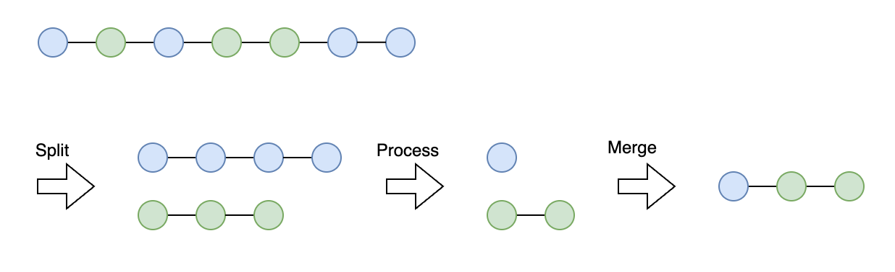

# Micro-Batching Library

This is a micro-batching library that processes jobs in batches.

It takes a job and put it in the queue. It calls BatchProcessor by the frequency and batch size set by the user.

## Design

### Queue

The queue is a FIFO queue implemented using a slice. The time complexity of `Enqueue()` is O(1), amortized constant time, although at worst case it needs to resize and copy all elements. The time complexity of `Dequeue(k)` is O(N) because it removes elements from the beginning of a slice.

There are several other possible ways to implement this queue:
- Using a linked list
  - This would make `Dequeue(k)` O(k) but both `Enqueue()` and `Dequeue()` are likely slower than a slice. Probably only suitable when the `Dequeue(k)` is called frequently.
- Using a ring buffer
  - `container/ring` in Go provides a ring buffer implementation. It will have better performance than a slice because it doesn't need to resize the buffer or move elements. But in this implementation, the size of the ring is fixed. If the buffer is full, we need to decide whether to drop the new job or to remove the oldest job.
- Implementing a ring buffer by a slice with pointers to the head and tail
  - `Dequeue(k)` will have better performance because it doesn't need to move elements. It will be more complex to implement and maintain.

When performance comes to play, we should consider the trade-offs between these possible implementations.

### Preprocessing

The library allows user to preprocess jobs before processing them in batches: `jobs := preprocess(jobs)`

The idea is to allow users to preprocess jobs before processing them in batches. For example, if we have a job that is a balance update, we can preprocess it by aggregating all balance updates for the same user. This way, we can reduce the number of jobs to process in batches.

For example, following 5 jobs can be preprocessed into 2 jobs:

```
[
  {"type": "BALANCE_UPDATE", "userId": "1", "amount": 10},
  {"type": "BALANCE_UPDATE", "userId": "1", "amount": 30},
  {"type": "BALANCE_UPDATE", "userId": "2", "amount": 20},
  {"type": "BALANCE_UPDATE", "userId": "1", "amount": 50},
  {"type": "BALANCE_UPDATE", "userId": "1", "amount": 70}
]
```

Preprocessed jobs:

```
[
  {"type": "BALANCE_UPDATE", "userId": "1", "amount": 70},
  {"type": "BALANCE_UPDATE", "userId": "2", "amount": 20}
]
```

`JobProcess` can accept multiple processors which implemented to preprocess jobs based on the job type.

```go
jobPreprocessing := NewJobProcess()

jobPreprocessing.Use("JobTypeA", &ProcessorA1{})
jobPreprocessing.Use("JobTypeA", &ProcessorA2{})
jobPreprocessing.Use("JobTypeB", &ProcessorB{})

jobs = jobPreprocessing.Process(jobs)
```

`JobProcess` split jobs by types, process each type of jobs by the processors registered for the type, and merge the processed jobs to return.

[](preprocessing.png)

## Limitations

### Multithreading

This library is not thread-safe, `Enqueue()` and `Dequeue()` can cause race condition. If you want to use this library in a multi-threaded environment, you need to add a lock to the queue.

Another option is to use thread-safe implementations like `github.com/enriquebris/goconcurrentqueue` or [lock free queue](https://github.com/golang-design/lockfree/blob/master/queue.go)
